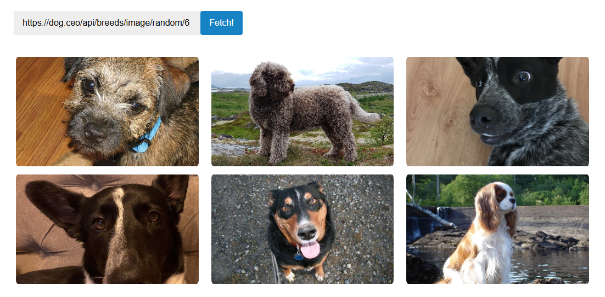

# Random Dog Gallery 🐶

A modern and interactive **dog image gallery** using the [Dog CEO API](https://dog.ceo/dog-api/).  
This project features **staggered grid animations, favorites, full-screen view, and a breed selector**.




## Features

- Display multiple **random dog images** with staggered fade-in (Pinterest-style)
- **Breed selector** to view specific dog breeds
- **Click to enlarge** images with a close button
- **Save favorite dogs** to localStorage
- **Auto slideshow OFF by default**; toggle button to turn it on
- Hover effects with zoom, shadows, and labels
- Responsive grid layout for all screen sizes
- Status messages for loading and errors

## Demo

Check it live: [Random Dog Gallery](https://faizullah98.github.io/random-dog-gallery/)

## Technologies Used

- HTML5 & CSS3  
- JavaScript (ES6+)  
- Fetch API & Async/Await  
- LocalStorage  

## How to Run Locally

1. Clone the repository:

```bash
git clone https://github.com/faizullah98/random-dog-gallery.git
